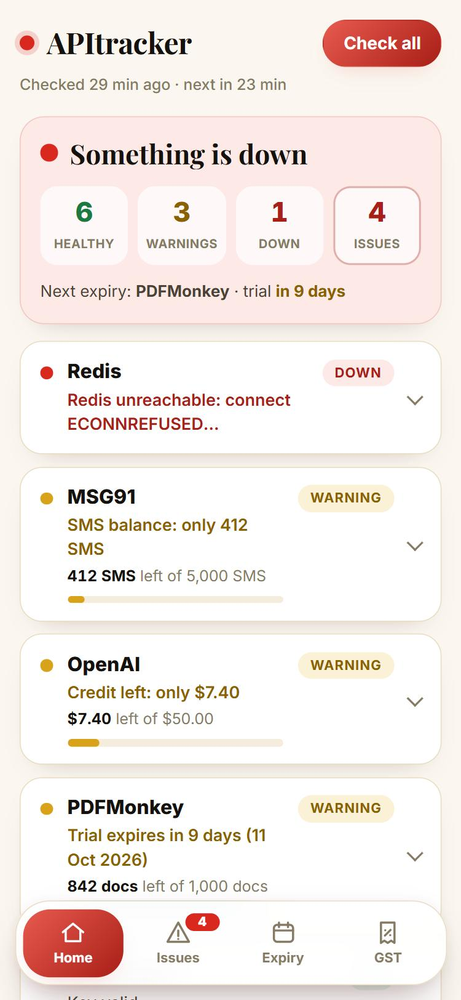
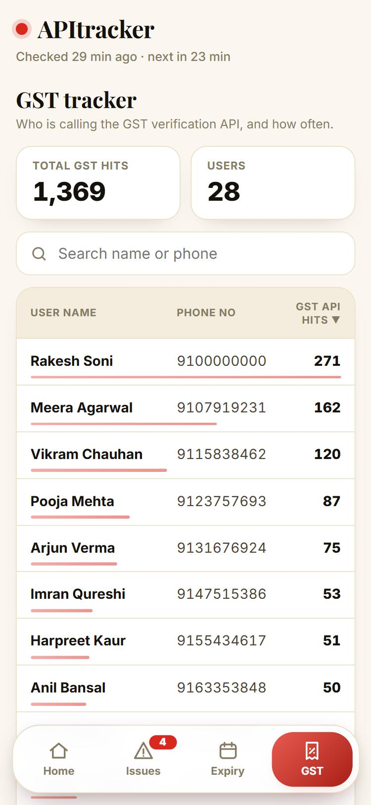
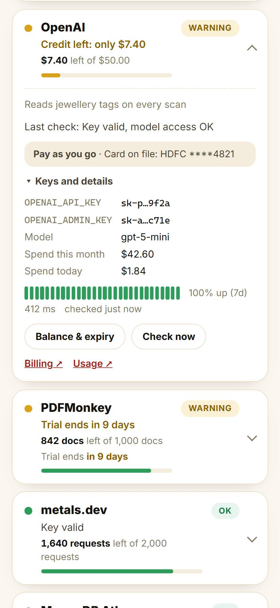
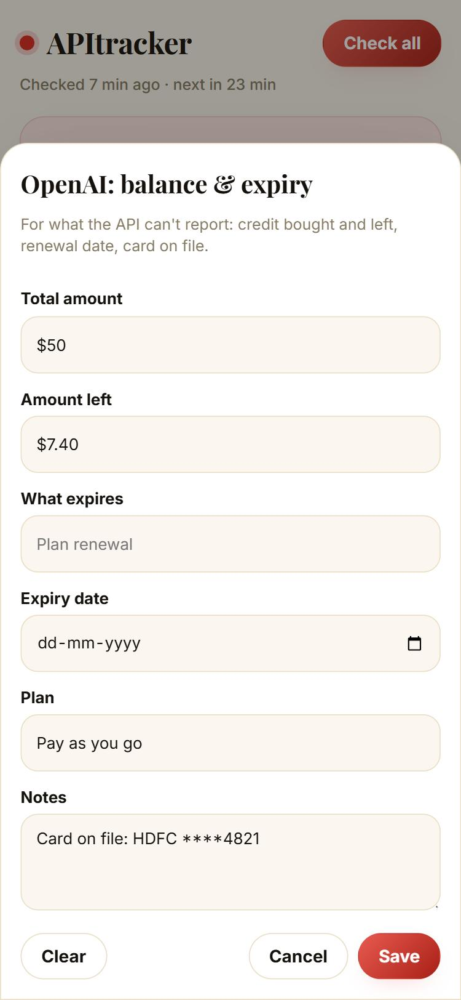

# UI redesign (design/)

A simpler, phone-first dashboard. The redesigned UI itself lives in `frontend/src`; this folder holds
the notes, screenshots and a no-API-key preview. No backend files were changed.






## What changed

- **Home** is only the summary and the services. The summary says how bad it is ("All good" / "Needs attention" /
  "Something is down") with Healthy / Warnings / Down / Issues counts and the next expiry. Each service is one compact
  row, worst first; tap it for keys, 7-day history, "Check now" and "Balance & expiry".
- **Floating bottom bar**: Home | Issues | Expiry | GST (replaces the top tabs). Issues shows the open count.
- **Expiry** is a tap-to-edit list, soonest first. The balance form opens as a bottom sheet on phones.
- **Issues** are rows that expand to the timeline, with "Mark resolved" inside.
- **GST tracker** (new): a grid of **User name | Phone no | GST API hits**, with total hits, user count,
  search (name or phone), sort (tap a header) and a small bar per row.
- Page scroll bar hidden on phone widths; scrolling is unchanged.

## GST tracker: data

Built: `GET /api/gst` (backend/src/gst.js) reads the MRPscan backend's `gst_verifications` collection — one row
per mobile + GST number for every GST check made during Create Account — and groups it per user:

```
{
  "users": [{
    "id": "u3f9…", "name": "Ravi Gupta", "phone": "98••••••10",   // full only with GST_SHOW_PHONES=true
    "hits": 3, "failures": 1, "status": "account",   // account (sign-up done) | started | verified | failed | unable
    "firstCheckedAt": "…", "lastCheckedAt": "…",
    "gsts": [{
      "gstNumber": "27AABCG1234F1Z5", "kind": "verified",      // verified | rejected | unable (registry down)
      "attempts": 2, "failures": 1, "reason": "", "errorCode": "", "statusCode": null,
      "details": { "legalName", "tradeName", "businessType", "address", "stateName", "pincode", "gstStatus", "isMock" },
      "verifiedAt", "lastFailedAt", "firstCheckedAt", "lastCheckedAt", "resolvedAt", "resolvedGstNumber",
      "accountCreatedAt": "…", "account": { "found": true, "name": "Gupta Jewellers", "registered": true, "step": "COMPLETED" }
    }]
  }],
  "totals": { "checks", "users", "gstNumbers", "verified", "failed", "unable", "accounts" },
  "updatedAt": "…", "truncated": false, "collectionMissing": false, "phonesMasked": true
}
```

`hits` = GST checks by that user. Totals count users, like the chips (All / Verified / Failed / Couldn’t verify /
Account created). "Account created" = the business finished sign-up; a confirmed GST without that is "started".
The screen shows six totals, the chips, search over name, phone, GST number and business name, and each row opens into one card per GST number.
A 404 (an older server) still shows "Not connected yet"; a 503 shows the database error.

## Known limits
- Checked in a browser against fake data only; not yet run in the Android WebView or against the real backend.
- The grid keeps its columns aligned with CSS `subgrid` (current Chrome / Android WebView); on older engines the
  phone-number column can shift slightly between rows.

## Preview without API keys
```bash
node design/preview/dev.js
```
Open http://localhost:4301 (Android-style phone frame; the plain dashboard is on http://localhost:4300).
The real backend is not started, so nothing here touches any API or key. `frontend/dist` is rebuilt when the
server starts; to rebuild while it runs: `node frontend/scripts/build.js`.
